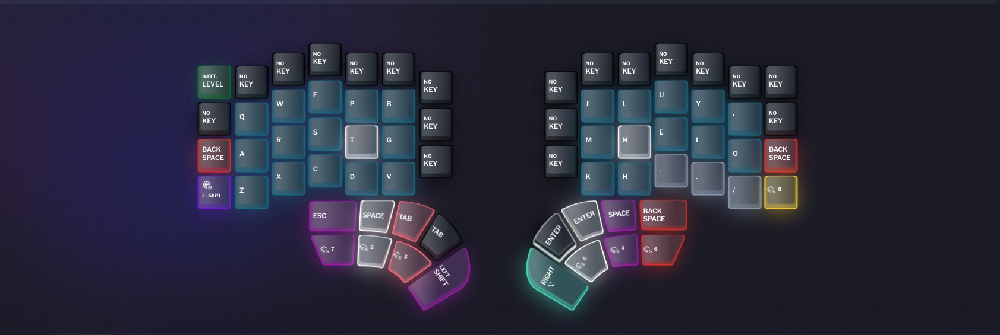

# My Defy Layers - Miryoku layout - colemak-dh

The layers used for my [Dygma Defy](https://dygma.com/products/dygma-defy) keyboard.

## Default/Base Layer

colemak-dh layout

## Navigation layer

Navigation keys with right hand.

## Mouse layer

Move cursor with right hand.

## Numpad layer

Number keys with left hand.

## Symbol keys layer

Symbol keys with left hand.

## Functional Row

12 function keys with left hand.

## Media layer

Media layer with right hand.

